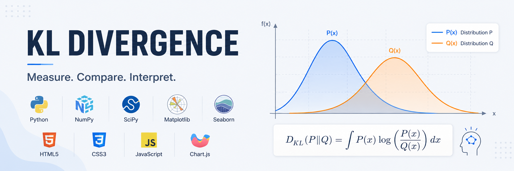
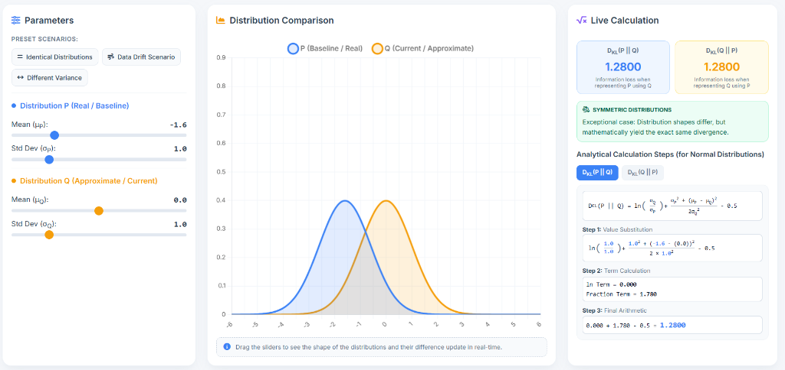
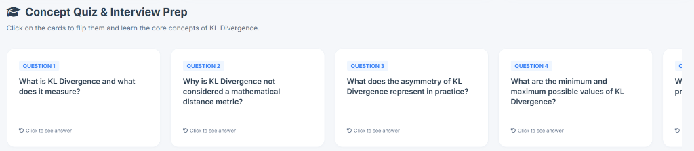
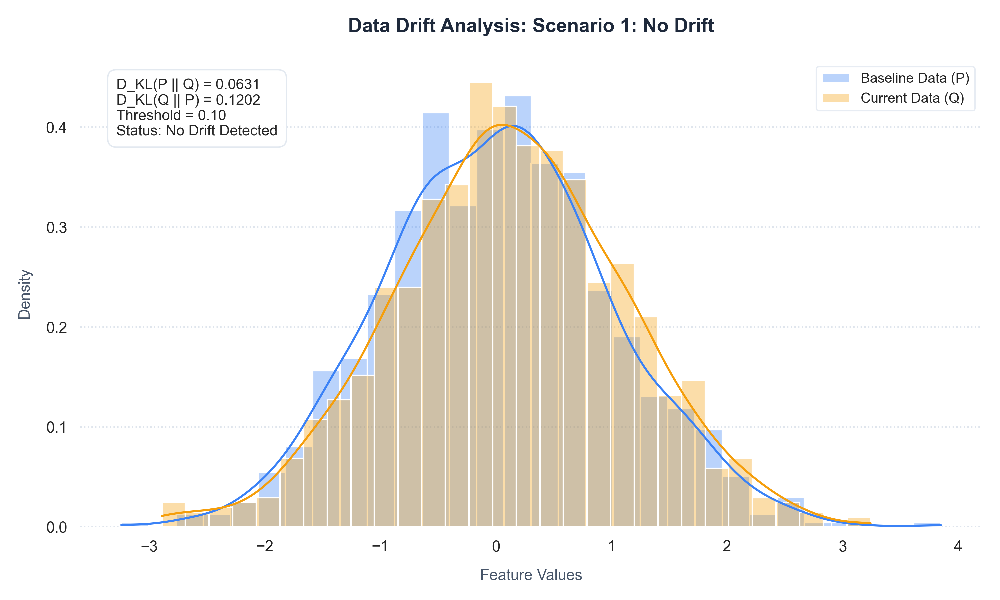
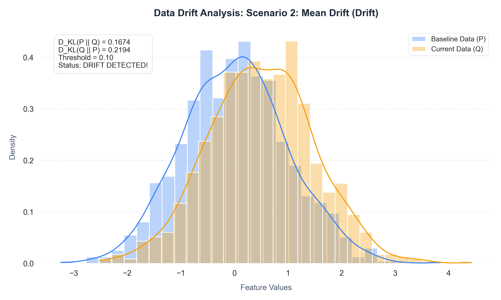
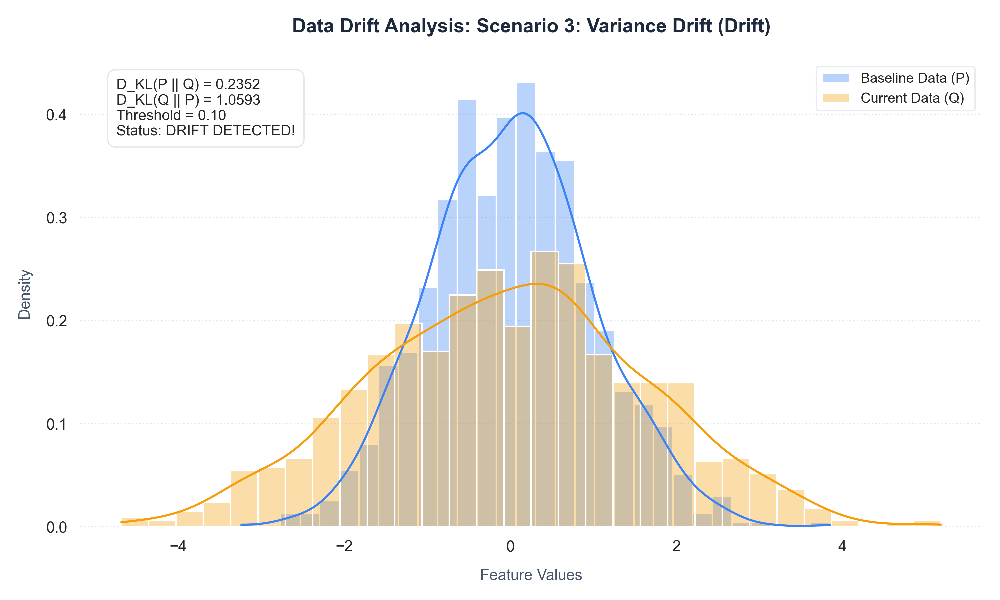

# 📊 KL Divergence Portal: Interactive Learning & Data Drift Detection



<p align="center">
  <a href="https://avazasgarov.github.io/kl-divergence-portal/"></a>
</p>

<p align="center">
  <a href="https://www.python.org/"></a>
  <a href="LICENSE"></a>
  <a href="#"></a>
  <a href="#"></a>
</p>

This project provides a comprehensive hands-on platform to learn, analyze, and visualize **Kullback-Leibler (KL) Divergence** (relative entropy)—one of the most fundamental concepts in Information Theory and Machine Learning. 

It is designed to explain the mathematical mechanics of KL divergence interactively and demonstrate how it is used practically in production systems for monitoring models.

Developed by **[Avaz Asgarov](https://www.linkedin.com/in/avaz-asgarov/)**.

---

## 🧮 What is KL Divergence?

Kullback-Leibler (KL) Divergence measures how much one probability distribution differs from a reference probability distribution. 

Given a true (actual) probability distribution $P(x)$ and an approximating (modeled) distribution $Q(x)$, the KL divergence quantifies the average information loss (expressed in bits or nats) when representing $P$ using $Q$.

### Mathematical Definitions

*   **For discrete distributions:**
    $$D_{KL}(P \parallel Q) = \sum_{x \in X} P(x) \log\left(\frac{P(x)}{Q(x)}\right)$$

*   **For continuous distributions:**
    $$D_{KL}(P \parallel Q) = \int_{-\infty}^{\infty} p(x) \log\left(\frac{p(x)}{q(x)}\right) dx$$

### Analytical KL Divergence Between Two Normal (Gaussian) Distributions
For $P \sim \mathcal{N}(\mu_P, \sigma_P^2)$ and $Q \sim \mathcal{N}(\mu_Q, \sigma_Q^2)$, the KL divergence can be computed directly without integration using the following analytical formula:
$$D_{KL}(P \parallel Q) = \log\left(\frac{\sigma_Q}{\sigma_P}\right) + \frac{\sigma_P^2 + (\mu_P - \mu_Q)^2}{2\sigma_Q^2} - \frac{1}{2}$$

### Key Properties
1.  **Non-negativity:** $D_{KL}(P \parallel Q) \geq 0$ for all distributions. It equals $0$ if and only if $P = Q$.
2.  **Asymmetry:** KL divergence is not symmetric, meaning $D_{KL}(P \parallel Q) \neq D_{KL}(Q \parallel P)$. Because it violates symmetry and the triangle inequality, it is mathematically considered a divergence, not a distance metric.

---

## 📂 Project Directory Structure

Explore the files in the repository:

*   📂 [**assets/**](./assets/) - Directory containing visual assets
    *   🖼️ [**banner.png**](./assets/banner.png) - GitHub repository banner
    *   🖼️ [**web_dashboard.png**](./assets/web_dashboard.png) - Dashboard screenshot
    *   🖼️ [**web_quiz.png**](./assets/web_quiz.png) - Grab-to-scroll quiz screenshot
*   📂 [**python/**](./python/) - Model drift analysis module
    *   📄 [**requirements.txt**](./python/requirements.txt) - Python package dependencies
    *   🐍 [**drift_detector.py**](./python/drift_detector.py) - Drift detector engine using SciPy
    *   📂 [**output/**](./python/output/) - Generated Matplotlib comparison plots
*   📂 [**web/**](./web/) - Browser visual portal
    *   🌐 [**index.html**](./web/index.html) - Main dashboard structure and quiz layout
    *   🎨 [**style.css**](./web/style.css) - Theme parameters and horizontal scroll rules
    *   javascript_symbol [**app.js**](./web/app.js) - Chart updates, drag scroll, and simulation calculations

---

## 🚀 Execution Instructions

### 1. Python Data Drift Detector
Install the required dependencies and run the simulation script to test the detector on different scenarios:
```bash
cd python
pip install -r requirements.txt
python drift_detector.py
```
This script computes the KL divergence across simulated datasets, outputs logs to the console, and generates visualization charts under the [python/output/](./python/output/) directory.

### 2. Interactive Web Dashboard
There is no need for local server setup. Simply open [web/index.html](./web/index.html) in any modern web browser (Chrome, Firefox, Safari, Edge) to start interacting with the distributions, checking the analytical steps, and practicing the concept quiz.

---

## 💡 Components and Visualization Details

### 1. Interactive Web Dashboard
The web dashboard is a clean, modern single-page educational portal built with HTML5, CSS3, JavaScript, and Chart.js.



*   **Live Parameter Sliders:** Interactively shift the mean ($\mu$) and standard deviation ($\sigma$) of both distribution $P$ and $Q$.
*   **Dual-Direction Analytical Steps:** View the step-by-step math computation updating in real-time. Use the toggles to switch between calculating $D_{KL}(P \parallel Q)$ and $D_{KL}(Q \parallel P)$ to observe math differences.
*   **Interactive Grab-to-Scroll Concept Quiz:** Grab and drag cards horizontally to review essential interview questions about KL divergence.
*   **Premium Typography:** Rendered completely in the premium `Inter` font for glyph consistency.



### 2. Python Data Drift Detector
The script [python/drift_detector.py](./python/drift_detector.py) models real-world model monitoring. Continuous incoming features are dynamically binned, smoothed via Laplace Smoothing to avoid zero-probability issues, and evaluated against the training baseline.

Matplotlib and Seaborn generate three evaluation charts in [python/output/](./python/output/):

#### Scenario 1: No Drift
Both datasets originate from similar normal distributions ($loc=0.0, scale=1.0$ vs $loc=0.05, scale=1.0$). The divergence value remains below the warning threshold ($0.10$), indicating no model updates are needed.



#### Scenario 2: Mean Shift (Drift)
The current production data experiences a drift in mean ($loc=0.5$). The KL divergence $D_{KL}(P \parallel Q)$ crosses the threshold, flagging that a model retrain is necessary.



#### Scenario 3: Variance Shift (Drift)
The current production data experiences an increase in dispersion/spread ($scale=1.6$). The asymmetry of KL divergence shows that expanding variance behaves differently than mean shifts, crossing the warning threshold.


